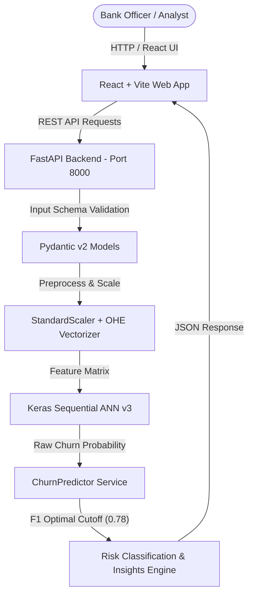

# 🏦 ApexBank Churn AI — Customer Retention Intelligence Studio

[](https://www.python.org/)
[](https://fastapi.tiangolo.com/)
[](https://www.tensorflow.org/)
[](https://react.dev/)
[](https://vitejs.dev/)

An enterprise-grade Customer Churn Prediction Engine powered by an **Artificial Neural Network (v3)** trained with **SMOTE oversampling**, **5-fold stratified cross-validation**, and **F1-optimal threshold tuning (0.78)**. Paired with a modern React + Vite glassmorphism Web Studio and FastAPI REST backend.

---

## ✨ Features

- **🎯 Single Customer Churn Predictor**: Interactive input form with sliders and dropdowns, live SVG probability gauge, risk level classification (**Low**, **Medium**, **High**, **Critical**), risk drivers breakdown, and tailored retention action plans.
- **📊 Portfolio Batch Analytics**: Drag-and-drop CSV batch upload (up to 100 records per call), sample dataset generator, interactive Recharts risk tier distribution, filterable prediction ledger, and CSV export.
- **⚡ What-If Scenario Simulator**: Side-by-side comparison of baseline vs. simulated customer states, providing real-time calculation of churn probability deltas when changing active status or adding products.
- **🔬 Model Introspection Hub**: Complete visibility into ANN model architecture, SMOTE sampling details, F1 cutoff metrics, and one-hot encoded feature vector schemas.

---

## 🏗️ System Architecture



---

## 📂 Project Structure

```text
Bank churnrate/
├── backend/
│   ├── config.py             # Centralised paths, risk bands, & app metadata
│   ├── main.py               # FastAPI entry point & static frontend server
│   ├── models/
│   │   └── schemas.py        # Pydantic v2 request/response validation
│   ├── routers/
│   │   ├── health.py         # Health probes & model info endpoints
│   │   └── predict.py        # Single & batch prediction routes
│   ├── services/
│   │   └── predictor.py      # ChurnPredictor singleton & inference logic
│   └── utils/
│       └── preprocessing.py  # Data scaling & one-hot encoding transformers
├── frontend/
│   ├── src/
│   │   ├── api.js            # Fetch client for FastAPI backend
│   │   ├── App.jsx           # Tab management & root layout
│   │   ├── index.css         # Glassmorphism design system & CSS variables
│   │   └── components/
│   │       ├── Header.jsx           # Studio header & tab navigation
│   │       ├── SinglePredictor.jsx  # Single customer assessment form & SVG gauge
│   │       ├── BatchPredictor.jsx   # CSV upload, Recharts & paginated ledger
│   │       ├── WhatIfSimulator.jsx  # Scenario delta comparison tool
│   │       └── ModelDashboard.jsx   # Technical architecture & feature schema
│   ├── index.html
│   ├── package.json
│   └── vite.config.js
├── model_artifacts/
│   ├── best_ann_v3.keras     # Trained Keras Sequential model
│   ├── scaler.pkl            # Fitted StandardScaler
│   ├── feature_names.pkl     # Feature vector names list
│   ├── threshold.json        # F1-optimal threshold (0.78)
│   └── model_metadata.json   # Training hyperparameters & metadata
├── export_artifacts.py       # Artifact generation script
├── Churn_Modelling.csv       # Training dataset
├── requirements.txt          # Python dependencies
└── README.md
```

---

## 🚀 Quick Start Guide

### Prerequisites
- **Python 3.10+**
- **Node.js 18+** & **npm**

### 1. Install Dependencies

**Python Dependencies:**
```bash
pip install -r requirements.txt
```

**Frontend Dependencies:**
```bash
cd frontend
npm install
```

### 2. Build Frontend & Run Server

#### Option A: Production Single-Server Mode (Recommended)
Build the React frontend into static assets and let FastAPI serve both the REST API and Web Studio:

```bash
# Build frontend
cd frontend
npm run build

# Return to root & start FastAPI
cd ..
python -m uvicorn backend.main:app --host 127.0.0.1 --port 8000
```
Open **[http://127.0.0.1:8000/app/](http://127.0.0.1:8000/app/)** in your browser.

#### Option B: Independent Development Mode (Hot-Reloading)
Run backend and frontend dev servers concurrently:

```bash
# Terminal 1: Backend
python -m uvicorn backend.main:app --reload --port 8000

# Terminal 2: Frontend Dev Server
cd frontend
npm run dev
```
Open **[http://localhost:5173/](http://localhost:5173/)** in your browser.

---

## 🔌 API Endpoints Summary

| Method | Endpoint | Description |
| :--- | :--- | :--- |
| `POST` | `/predict` | Single customer churn prediction |
| `POST` | `/predict/batch` | Batch prediction (up to 100 customer records) |
| `GET` | `/predict/example` | Returns ready-to-use JSON payload examples |
| `GET` | `/health` | Liveness & readiness probe |
| `GET` | `/model/info` | Architecture, feature list, & threshold metadata |
| `GET` | `/docs` | Interactive Swagger API documentation |

---

## 📊 Model Training Highlights

- **Architecture**: Artificial Neural Network (Keras Tuner Hyperband-optimized).
- **Class Imbalance Strategy**: **SMOTE** (Synthetic Minority Over-sampling Technique) applied strictly to training folds.
- **Cross-Validation**: 5-Fold Stratified `KFold` cross-validation.
- **Classification Threshold**: F1-Optimal threshold tuned to **0.78** on held-out test data to maximize recall for high-value churners while balancing precision.

